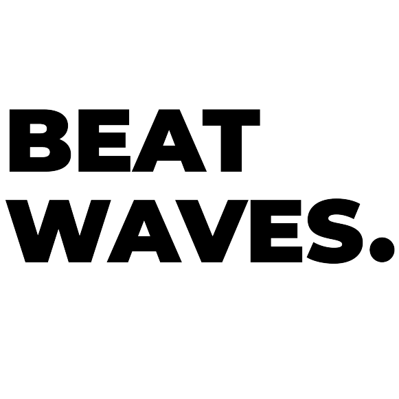

<!-- LOGO -->
 

    
  

  <h3 align="center">TRANSLATION OF MOVEMENT INTO MUSIC</h3>

  

    Welcome to the project : Beatwaves !
     
    You are currently reading the documentation, happy reading :)
  

<!-- TABLE  -->

  
Table of Contents :

  <ol>
    <li>
      <a href="#about-the-project">About The Project</a>
      <ul>
        <li><a href="#built-with">Built With</a></li>
      </ul>
    </li>
    <li>
      <a href="#getting-started">Getting Started</a>
      <ul>
        <li><a href="#prerequisites">Prerequisites</a></li>
        <li><a href="#installation">Installation</a></li>
      </ul>
    </li>
  </ol>

<!-- ABOUT THE PROJECT -->
## About The Project

<!--[  -->

Beatwaves is a video game project for a student project in alliance with developers and designers !

Currently, these are the two developers as contributors who occupy this project on GitHub

This is a game called : Beatwaves !

*Note : This project is a student project*

(<a href="#readme-top">Back to top !</a>)

### Built With

This section lists how the project was developed :

* 
* 

(<a href="#readme-top">Back to top !</a>)

<!-- GETTING STARTED -->
## Getting Started

To be able to play Beatwaves, you must stick to it as follows :

### Prerequisites

_To play Beatwaves, you must have these requirements :_

- A functional camera,
- Your person !

### Installation

_Below you will find how to play Beatwaves with its full potential. You must therefore :_

1.  Join our game : https://beatwaves.vercel.app
2.  Make sure you have a camera,
3. Stand approximately less than a meter from the camera,
4.  Have fun !

(<a href="#readme-top">Back to top !</a>)

